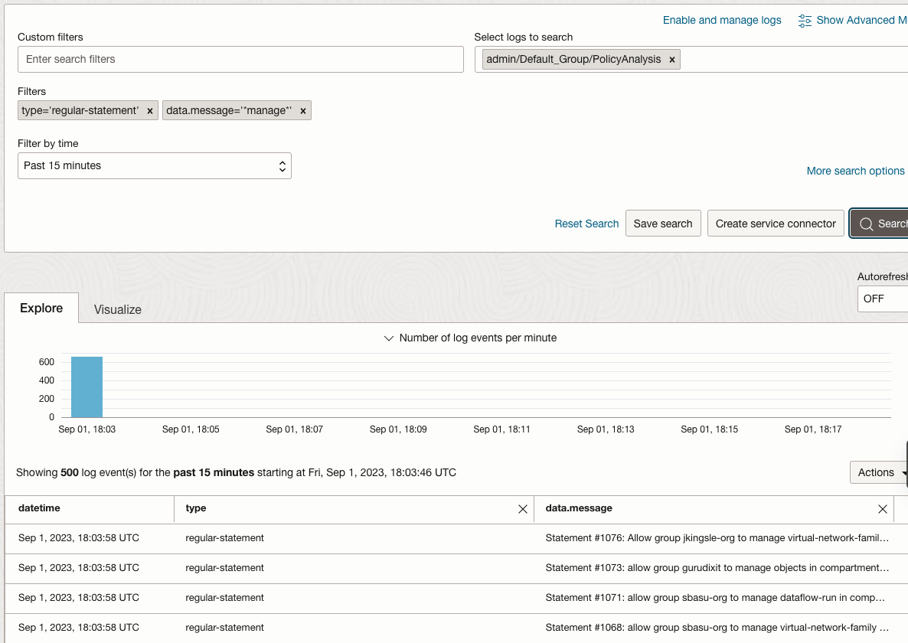

# Integration01 tenancy-admin
Scripts for maintaining orasenatdintegration01 tenancy

## Super-delete
Lorem ipsem...

## Policy Analysis
This script will run using instance principals and pull a recursive policy list, the nparse every statement into 4 categories:
* Special (define / endorse / etc)
* Service (allow service xxx)
* Dynamic Group (allow dynamic-group yyy)
* Regular (everything else)

Run the command with `-h` for help:
```bash
[opc@oci-superdelete tenancy-admin]$ python3 ./oci-policy-analysis.py -h
/home/opc/.local/lib/python3.6/site-packages/oci/_vendor/httpsig_cffi/sign.py:10: CryptographyDeprecationWarning: Python 3.6 is no longer supported by the Python core team. Therefore, support for it is deprecated in cryptography. The next release of cryptography (40.0) will be the last to support Python 3.6.
  from cryptography.hazmat.backends import default_backend  # noqa: F401
usage: oci-policy-analysis.py [-h] [-v] [-pr PROFILE] [-o OCID]
                              [-sf SUBJECTFILTER] [-vf VERBFILTER]
                              [-rf RESOURCEFILTER] [-lf LOCATIONFILTER]
                              [-m MAXLEVEL] [-c] [-w] [-ip]

optional arguments:
  -h, --help            show this help message and exit
  -v, --verbose         increase output verbosity
  -pr PROFILE, --profile PROFILE
                        Config Profile, named
  -o OCID, --ocid OCID  OCID of compartment (if not passed, will use tenancy
                        OCID from profile)
  -sf SUBJECTFILTER, --subjectfilter SUBJECTFILTER
                        Filter all statement subjects by this text
  -vf VERBFILTER, --verbfilter VERBFILTER
                        Filter all verbs (inspect,read,use,manage) by this
                        text
  -rf RESOURCEFILTER, --resourcefilter RESOURCEFILTER
                        Filter all resource (eg database or stream-family etc)
                        subjects by this text
  -lf LOCATIONFILTER, --locationfilter LOCATIONFILTER
                        Filter all location (eg compartment name) subjects by
                        this text
  -m MAXLEVEL, --maxlevel MAXLEVEL
                        Max recursion level (0 is root only)
  -c, --usecache        Load from local cache (if it exists)
  -w, --writejson       Write filtered output to JSON
  -ip, --instanceprincipal
                        Use Instance Principal Auth - negates --profile
  -lo LOGOCID, --logocid LOGOCID
                        Use an OCI Log - provide OCID
```
Run this with instance principals `-ip` flag:
```bash
python3 ./oci-policy-analysis.py -ip
<output>
```
The above will load all policies from the tenancy into cache files (use `ls -al` to see them).  Subesequent runs can use `-c` to laod from cache or omit it to scan the tenancy again.
Once loaded into memory, the script allows for filtering (see below).

Also with `-w` it will output JSON of what is in memory (filtered) so that it can be looked at later or in another tool.

### Filtering Commands
To filter, think of the components of a policy statement (subject, verb, resource, location).  The filters simply do a text match (case-insensitive).  For example, if there are 1000 statements and you add a filter like `-sf mygroup`, the list will be pared down to only those statements.

Filters can be combined.  Meaning that adding 2 or even 3 or 4 filters will get the list down further.  Example, to find all occurrences of `manage` and `tenancy`, do this:
```bash
python3 ./oci-policy-analysis.py -ip -c -vf manage -lf tenancy
```
### OCI Logging
To write policy statements to OCI Log, provide `-lo <log_ocid>`.  By doing this it will write all policy statements to an OCI Log.  Then use OCI Logging Search to see the output.




## Find Unused Dynamic Groups
Companion to policy script.  Uses the cached policy statements and loads all DGs from the tenancy into memory.  Once loaded, it checks to see if there are any DG policy statements that are applicable.  If not, it adds to a list (no deletes).

Run this with:
```bash
python3 ./oci-unused-dynamic-groups.py -ip
<lists unused DGs with OCID>
```

